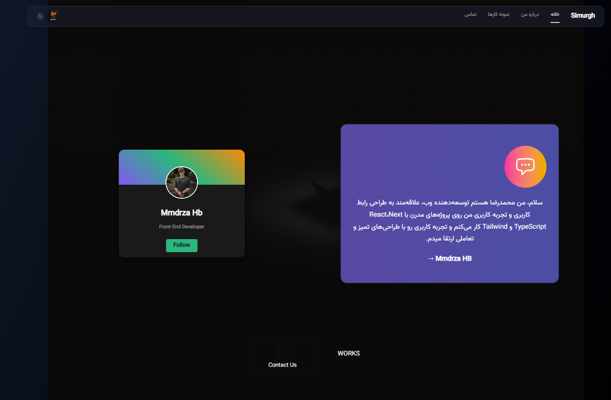

# 🌐 Personal Blog

اسایت شخصی من که با **React**, **Next**,**TypeScript**, و **Tailwind CSS** ساخته شده.  
این پروژه برای نمایش مهارت‌های من در طراحی و توسعه وب، انیمیشن‌های روان، و طراحی ریسپانسیو ساخته شده است.  Expand commentComment on line R75Code has comments. Press enter to view.

---

## 🚀 لینک دمو
[📎 مشاهده سایت آنلاین](https://simurgh420.github.io/personalblog/)

---

## 🖼 پیش‌نمایش
  
*(تصویر بالا نمونه‌ای از صفحه اصلی سایت است. برای دیدن نسخه کامل روی لینک دمو کلیک کنید.)*

---

## ✨ ویژگی‌ها
- طراحی مدرن و مینیمال با **Tailwind CSS**
- انیمیشن‌های روان با **Framer Motion**
- ریسپانسیو کامل برای موبایل، تبلت و دسکتاپ
- مدیریت مسیرها با **React Router v7 (Data Router API)**
- پشتیبانی از حالت تاریک/روشن (Dark Mode)
- دیپلوی شده روی **GitHub Pages**

---

## 🛠 تکنولوژی‌های استفاده‌شده
- ⚛️ React 
- ⌨️ TypeScript
- 🎨 Tailwind CSS
- 🎬 Framer Motion
- 🧩 shadcn/ui
- 🌍 React Router 
- 🚀 GitHub Pages

---

## 📦 نصب و راه‌اندازی

```bash
# کلون کردن ریپازیتوری
git clone https://github.com/simurgh420/personalblog.git

# ورود به پوشه پروژه
cd personalblog

# نصب وابستگی‌ها
npm install

# اجرای پروژه در حالت توسعه
npm run dev